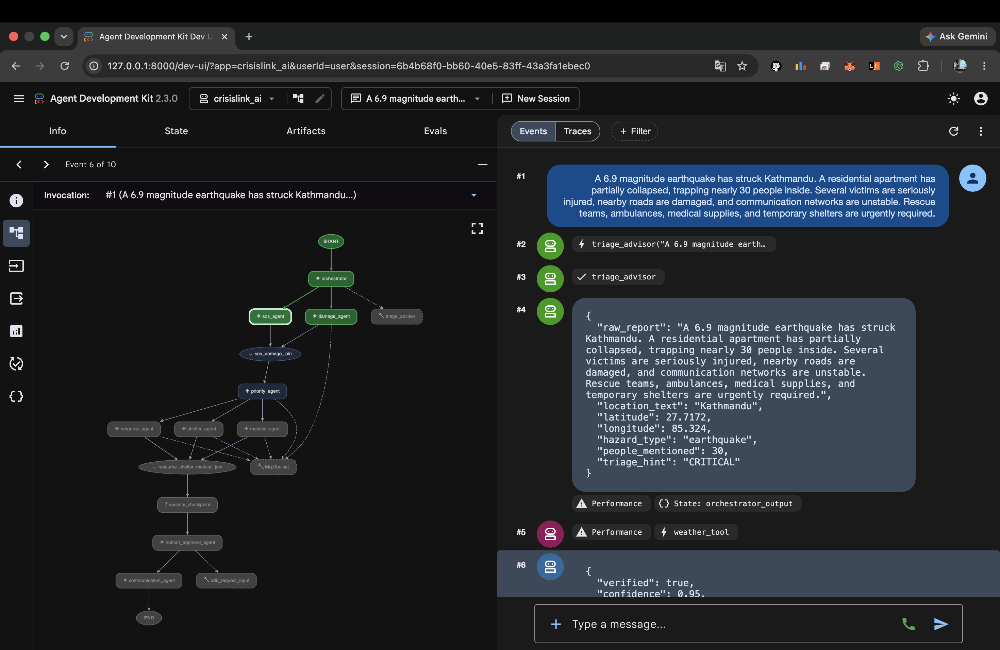
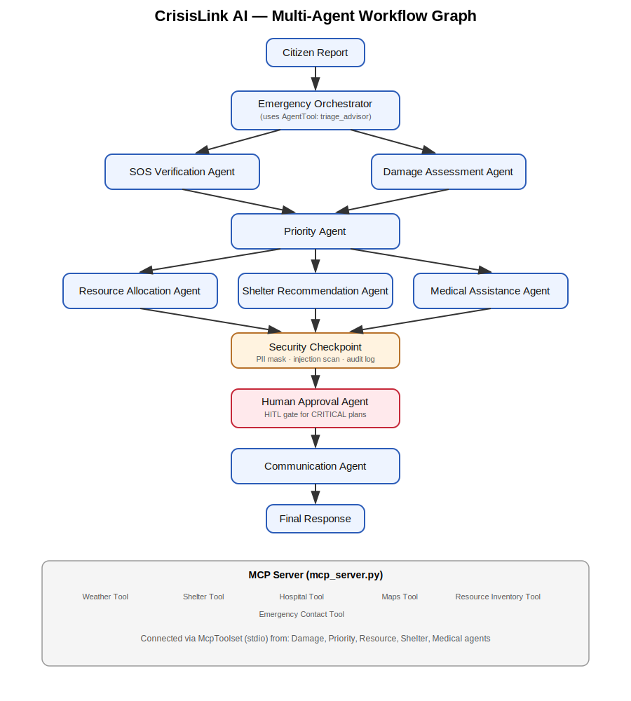

# 🛰️ CrisisLink AI

**AI-Powered Multi-Agent Disaster Coordination System** — built for the Google AI Agent Builder Series 2026, *Agents for Good* track.

CrisisLink AI takes a raw citizen emergency report and turns it into a verified, prioritized, resourced, security-checked rescue plan — using a Google ADK 2.x graph-based **Workflow**, an **MCP server** for tools, and a **human-in-the-loop** gate for critical decisions.


---

## Demo

### ADK Workflow Execution

<p align="center">
  
</p>


### Multi-Agent Architecture

<p align="center">
  
</p>


---

## Architecture

```text
Citizen
   │
   ▼
Emergency Orchestrator  (AgentTool → triage_advisor)
   │
   ├─────────────┐
   ▼             ▼
SOS Agent    Damage Agent          (parallel)
   └──────┬──────┘
          ▼
   Priority Agent
          │
   ┌──────┼──────┐
   ▼      ▼      ▼
Resource Shelter Medical            (parallel)
   └──────┼──────┘
          ▼
  Security Checkpoint   (code, not LLM: PII mask + injection scan + audit log)
          ▼
  Human Approval Agent  (HITL gate — only for CRITICAL priority)
          ▼
  Communication Agent
          ▼
   Final Response
```

See `assets/architecture_diagram.svg` for the rendered version.


---

## Folder Structure

```text
crisislink-ai/
├── assets/                    architecture diagram (SVG)
├── tests/                     pytest suite (security + agents/tools)
├── crisislink_ai/
│   ├── agents/                 8 LlmAgent nodes + human_approval_agent
│   ├── tools/                  weather / shelter / hospital / maps / inventory / contacts
│   ├── security/               PII masking, prompt-injection detection, audit log, security checkpoint
│   ├── agent.py                root Workflow graph (root_agent — discovered by `adk web` / `adk run`)
│   ├── mcp_server.py           FastMCP server exposing all tools over stdio
│   ├── mcp_client.py           shared McpToolset used by tool-calling agents
│   └── config.py               environment-driven settings
├── fast_api_app.py             FastAPI service (/sos, /health)
├── README.md
├── SUBMISSION_WRITEUP.md
├── DEMO_SCRIPT.txt
├── Makefile
├── pyproject.toml
├── .env.example
└── Dockerfile
```


---

## ADK Requirements Checklist

| Requirement | Where |
|---|---|
| Workflow API | `crisislink_ai/agent.py` — `Workflow(edges=[...])` graph |
| Minimum 6 LlmAgents | 8 agents in `crisislink_ai/agents/` + `human_approval_agent` |
| MCP Server | `crisislink_ai/mcp_server.py` (FastMCP, stdio transport) |
| MCPToolset | `crisislink_ai/mcp_client.py`, used by damage/priority/resource/shelter/medical agents |
| AgentTool | `orchestrator_agent` wraps a `triage_advisor` sub-agent via `AgentTool` |
| Security Checkpoint | `crisislink_ai/security/checkpoint.py` (graph node, not an LLM call) |
| Prompt Injection Detection | `crisislink_ai/security/prompt_injection_detector.py` |
| PII Scrubbing | `crisislink_ai/security/pii_masking.py` |
| Human Approval | `crisislink_ai/agents/human_approval_agent.py` (uses ADK's `request_input` long-running tool) |
| FastAPI | `fast_api_app.py` |
| Docker | `Dockerfile` |
| ctx.state | agents read `{orchestrator_output}`, `{sos_result}`, etc. via ADK session state |


---

## Setup

```bash
cd crisislink-ai
cp .env.example .env

# put your real Gemini key in .env:
# GOOGLE_API_KEY=...

uv sync
```

No `GOOGLE_MAPS_API_KEY` or `WEATHER_API_KEY`? That's fine — `weather_tool` calls the free, keyless Open-Meteo API, and the remaining tools fall back to a seeded mock database so everything works offline for judging.


---

## Run It

```bash
make playground
make web
make api
make mcp
make test
```


Try the demo scenario:

```bash
curl -X POST http://localhost:8080/sos \
  -H "Content-Type: application/json" \
  -d '{"report_text":"There is severe flooding in Patna. 15 people trapped near Gandhi Setu."}'
```


---

## Verification Already Done

Before handing this scaffold over, the following was actually run and confirmed:

1. `pip install google-adk mcp`
2. Workflow graph constructed successfully.
3. FastAPI routes verified.
4. MCP server verified.
5. `pytest tests/` → **13/13 passing**.


Run locally:

```bash
uv sync
make playground
```

Then check `audit_log.jsonl`.


---

## Known Gaps / Next Steps

- `damage_agent` currently supports only text.
- Shelter and hospital data use a seeded mock database.
- `human_approval_agent` requires an ADK-compatible UI (`adk web` / `adk run`) for interactive approval.


## Contributing

Contributions are welcome! Check the [Issues](../../issues) tab for `good first issue` labeled tasks. Fork the repo, create a branch, and submit a PR — see individual issues for setup details.

<br>

## Author

Sunny Kumar — Co-Organizer & Tech Lead, GDG On Campus BCE Patna · Beta MLSA · GFG Campus Mantri


